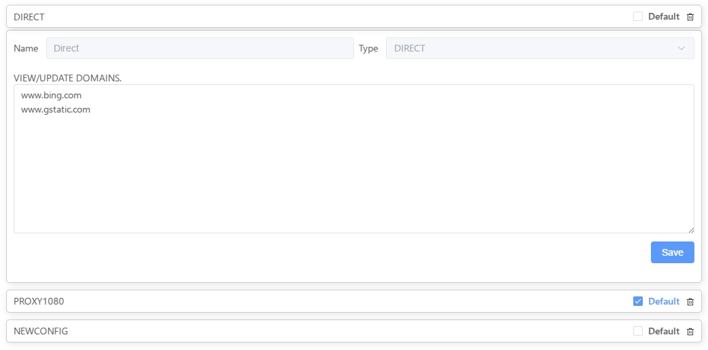
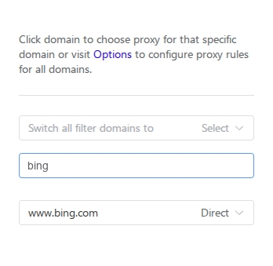

# Chrome Proxy Manager

## Overview
This Chrome extension allows users to quickly configure domain-specific proxy settings. It enables users to assign different proxies to specific domains and manage their proxy configurations efficiently.

## Features
- Assign different proxies to specific domains.
- Support for various proxy types: HTTP, HTTPS, SOCKS4, SOCKS5.
- Default proxy configuration.
- Dynamic PAC (Proxy Auto-Config) script generation.
- Automatic storage of proxy preferences using Chrome's `chrome.storage.sync`.
- Tracking and management of visited domains per tab.
- User-friendly Chrome extension integration.

## Installation
1. Clone this repository or download the source files.
2. Open Chrome and navigate to `chrome://extensions/`.
3. Enable "Developer mode" in the top right corner.
4. Click on "Load unpacked" and select the project folder.
5. The extension is now installed and ready to use.

## Usage
1. Open the extension popup.
2. Add domain-specific proxy rules.
3. Select a default proxy.
4. The extension will automatically apply the settings.
5. View and manage assigned proxies for different domains.

## Screenshots
  
*Example of the proxy pool configuration page.*

  
*One-click proxy application on a page.*

## Configuration Options
- **Default Proxy**: The fallback proxy used when no domain-specific rule applies.
- **Domain-Specific Proxies**: Assign proxies to particular domains with flexible matching rules.
- **Direct Connection**: Bypass proxy for certain domains if needed.

## How It Works
1. The extension listens for network requests and determines the appropriate proxy based on user settings.
2. It dynamically generates a PAC script to handle proxy assignments.
3. Chrome's proxy API is used to apply the generated PAC script.
4. Changes are saved in `chrome.storage.sync` to persist user settings.

## Permissions Required
- `storage`: To save user preferences.
- `proxy`: To manage proxy settings.
- `tabs`: To track active tabs and domain visits.
- `webRequest`: To monitor domain activity.

## License
This project is open-source and available under the MIT License.

## Contributing
Contributions are welcome! Feel free to submit issues or pull requests.

## Acknowledgments
This extension was inspired by the now-deprecated **Proxy Switchy Auto** extension.

## Contact
For support or suggestions, open an issue in the repository.

